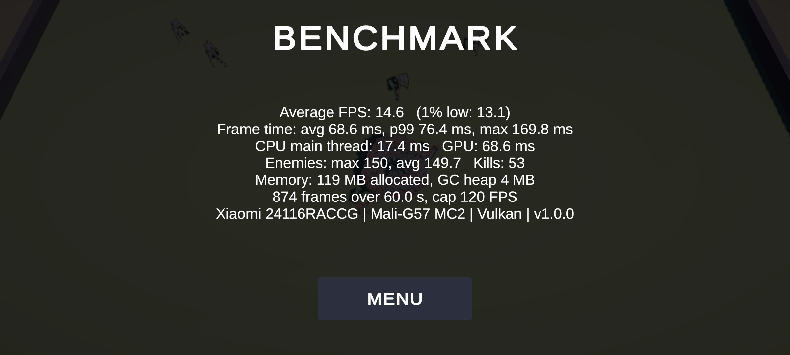
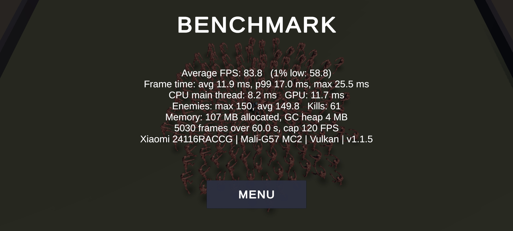
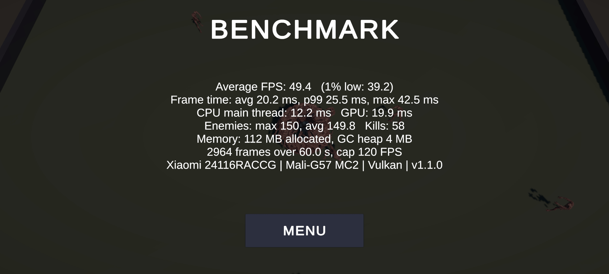
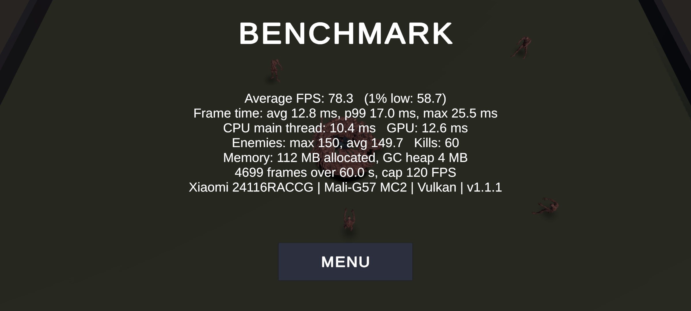
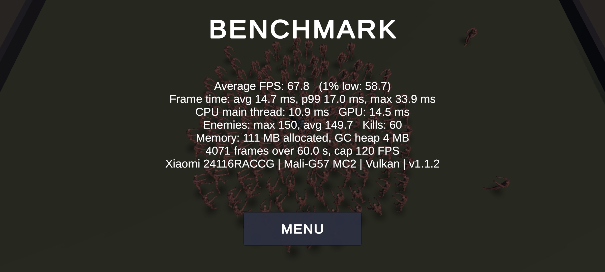
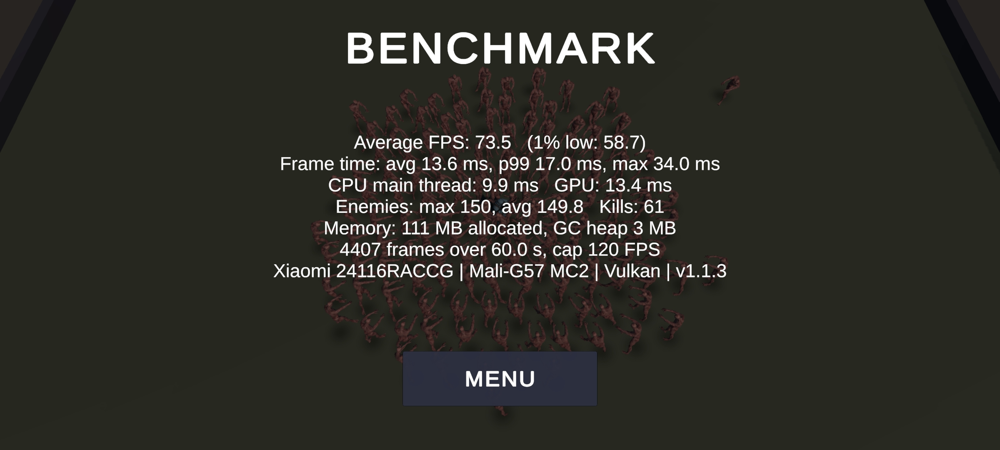
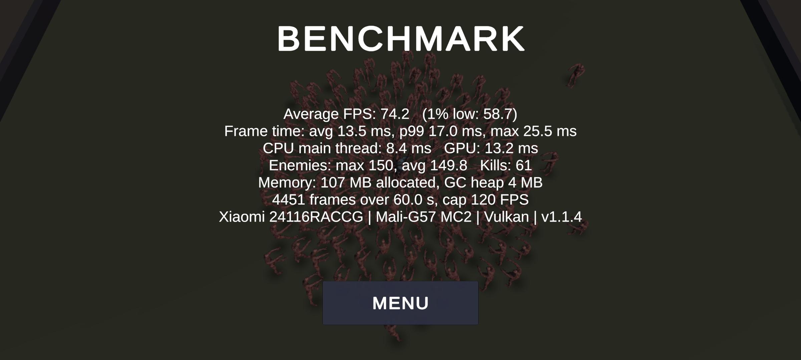

# Performance

**English** | [Türkçe](PERFORMANCE.tr.md)

Measurements of the reference build (before optimization) and the optimized build. All of them were taken under the
same conditions with the in-game benchmark (see `TECH.md` > Benchmark mode).

## Summary

| | Reference (`v1.0-reference`) | Optimized (`v1.1-optimized`) | Change |
|------|------|------|------|
| Average FPS (150 enemies) | 14.6 | **83.8** | **x5.7** |
| Frame time | 68.6 ms | 11.9 ms | -83% |
| GPU time | 68.6 ms | 11.7 ms | -83% |
| CPU main thread | 17.4 ms | 8.2 ms | -53% |
| Allocated memory | 119 MB | 107 MB | -10% |
| APK size | 50.2 MB | ~42 MB | -16% |
| Enemy triangles (LOD0 / LOD1) | 36,902 | 4,500 / 1,500 | |
| Enemy textures | 8 x 4096² | 1 x 1024 x 512 | |

| Reference (`v1.0-reference`): 14.6 FPS | Optimized (`v1.1-optimized`): 83.8 FPS |
|------|------|
|  |  |

The benchmark result screens on the phone. The difference also shows in the arena behind them: in the reference the
150 enemies are one pile on top of the player, in the optimized build a crowd spread across the screen (a heavier scene).

The 60 FPS target (16.7 ms) is met using about 70% of the budget. The scene measured in the optimized build is heavier
than the reference: enemies push each other apart and spread across the screen (Step 4), while in the reference they
were one pile on top of the player.

| Step | Change | FPS | GPU | CPU |
|------|------|------|------|------|
| Reference | Original assets | 14.6 | 68.6 | 17.4 |
| 1 | Enemy model: LODs, atlas, 22 bones | 49.4 | 19.9 | 12.2 |
| 2 | Mobile render settings, blob shadows | 78.3 | 12.6 | 10.4 |
| 3 + 4 | Player model + enemy separation (heavier scene) | 67.8 | 14.5 | 10.9 |
| 5 | Jitter fix + more aggressive LOD | 73.5 | 13.4 | 9.9 |
| 6 | Generic clips, Optimize Game Objects, Cull Completely | 74.2 | 13.2 | 8.4 |
| 7 | Simple Lit enemy material | 83.8 | 11.7 | 8.2 |

(GPU and CPU times in milliseconds. Details of every step and the raw JSON results below.)

## Test conditions

| | |
|------|------|
| Device | Xiaomi Redmi Note 14 Pro (4G, model 24116RACCG) |
| SoC / GPU | MediaTek Helio G100-Ultra (MT6789) / Mali-G57 MC2 |
| RAM / OS | 8 GB / Android 16 (HyperOS 3) |
| Screen | 2400 x 1080, landscape |
| Graphics API | Vulkan |
| Build | Release (not development), IL2CPP, ARM64, URP "Mobile" quality level |
| Scenario | BENCHMARK button: seed 12345, 150 enemy cap, invulnerable and stationary player, 10 s warm-up + 60 s measurement, 120 FPS cap |
| Procedure | Phone charging, screen on, app freshly started, benchmark twice in a row |

Raw results: `Benchmarks/reference_run1.json`, `Benchmarks/reference_run2.json`, screenshot `Benchmarks/reference_run2.jpg`.

## Reference build (`v1.0-reference`)

Original models, textures and Humanoid Animators; no optimization.

| Measurement | Run 1 | Run 2 |
|------|------|------|
| Average FPS | 14.5 | 14.6 |
| 1% low FPS | 10.7 | 13.1 |
| Frame time avg / p99 / max (ms) | 69.0 / 93.4 / 161.3 | 68.6 / 76.4 / 169.8 |
| **GPU time per frame (ms)** | **69.0** | **68.6** |
| CPU main thread per frame (ms) | 17.4 | 17.4 |
| Enemies alive (average at the 150 cap) | 149.8 | 149.7 |
| Kills | 51 | 53 |
| Allocated memory | 119 MB | 119 MB |

The two runs agree within about 1% on average FPS, GPU and CPU time. Spawn positions are identical (fixed seed); the
kill counts differ slightly because the simulation advances with the real frame time and bullet hits shift by a few
milliseconds between runs. The load itself (enemies alive) is the same.

### Analysis

**The game is GPU-bound.** The frame time equals the GPU time (about 69 ms), while the CPU main thread only uses about
17 ms. Making the CPU faster would not raise the FPS unless the GPU cost goes down.

Likely GPU costs, ordered by expected impact:

1. **Geometry.** 150 enemies x 36,902 triangles = about 5.5 million triangles per frame, drawn once more for the shadow
   map. Far beyond what a Mali-G57 MC2 can handle at 60 FPS.
2. **Skinning.** Every enemy deforms an 18,453-vertex mesh with 65 bones every frame. The work scales with the vertex
   count, so a low-poly mesh reduces it proportionally; fewer bones help as well.
3. **Textures.** Eight 4096 x 4096 textures (diffuse, normal, specular, glossiness for two materials) use memory
   bandwidth, which is scarce on mobile GPUs. At the enemies' size on screen a single ASTC-compressed 1024 (or smaller)
   atlas is enough.
4. **Shadows and materials.** Shadows for 150 skinned meshes and two materials (two draw calls) per enemy.

On the CPU side (the next bottleneck once the GPU cost drops): 150 Humanoid Animators (retargeting is more expensive
than Generic), 65 animated bones in each, and the enemy logic.

### Optimization plan (prioritized by expected impact)

| # | Change | Target | Status |
|------|------|------|------|
| 1 | Decimate the enemy mesh in Blender as a new file to about 4-5k triangles (LOD0) and add a lower LOD | GPU geometry, skinning | Done (Step 1) |
| 2 | Merge the enemy textures into one 1024 (or 512) atlas, ASTC, one material | GPU bandwidth, draw calls, memory | Done (Step 1) |
| 3 | Enemy shadows (cheaper, or none in the distance) | GPU shadow pass | Done (Step 2, blob shadows) |
| 4 | Animator: fewer bones (drop fingers), cheaper culling mode, maybe Generic clips | CPU animation | Done (bones in Step 1, the rest in Step 6) |
| 5 | Player model: moderate decimation, merged materials; rifle textures to 512 | GPU, memory | Done (Step 3, measured together with Step 4) |

Every change is measured again on the same device with the same benchmark before moving on to the next one.

## Step 1: optimized enemy (`v1.1.0`, commit `749ca37`)

Change: the enemy prefab uses `Enemy_Optimized` (4,500 / 1,500 triangle LODs, 22 bones, at most 4 weights, one
material, 1024 x 512 ASTC atlas). Details in `TECH.md` > Optimized assets. Nothing else changed.

| Measurement | Reference (run 2) | Step 1 run 1 | Step 1 run 2 | Change |
|------|------|------|------|------|
| Average FPS | 14.6 | 49.3 | 49.4 | **x3.4** |
| 1% low FPS | 13.1 | 29.5 | 39.2 | x3.0 |
| Frame time avg / p99 (ms) | 68.6 / 76.4 | 20.3 / 33.9 | 20.2 / 25.5 | -71% |
| **GPU time (ms)** | **68.6** | 19.9 | **19.9** | **-71%** |
| CPU main thread (ms) | 17.4 | 12.4 | 12.2 | -30% |
| Allocated memory | 119 MB | 112 MB | 112 MB | -6% |
| APK size | 50.2 MB | 41.8 MB | | -17% |

Raw results: `Benchmarks/step1_enemy_run1.json`, `Benchmarks/step1_enemy_run2.json`, `Benchmarks/step1_enemy_run2.jpg`.

**Interpretation:** as the reference analysis predicted, the enemy asset was the biggest GPU cost. The CPU got faster
too: 43 fewer bones are animated per enemy and fewer weights are skinned. The frame time (20.2 ms) still equals the
GPU time; the game is still GPU-bound and about 3-4 ms away from 60 FPS (16.7 ms). Next: render settings (shadows,
resolution, post-processing).

## Step 2: mobile render settings (`v1.1.1`, commit `7cafdc1`)

Change (Mobile quality level only): post-processing off, HDR off, shadow distance 35 m, enemies use blob shadows instead
of real-time shadows. Details in `TECH.md` > Render settings.

| Measurement | Reference | Step 1 | Step 2 run 1 | Step 2 run 2 |
|------|------|------|------|------|
| Average FPS | 14.6 | 49.4 | 78.3 | **78.3** |
| 1% low FPS | 13.1 | 39.2 | 58.7 | **58.7** |
| Frame time avg / p99 / max (ms) | 68.6 / 76.4 / 169.8 | 20.2 / 25.5 / 42.5 | 12.8 / 17.0 / 34.0 | **12.8 / 17.0 / 25.5** |
| GPU time (ms) | 68.6 | 19.9 | 12.5 | **12.6** |
| CPU main thread (ms) | 17.4 | 12.2 | 10.3 | **10.4** |
| Allocated memory | 119 MB | 112 MB | 112 MB | 112 MB |

Raw results: `Benchmarks/step2_render_run1.json`, `Benchmarks/step2_render_run2.json`, `Benchmarks/step2_render_run2.jpg`.

**Interpretation:** removing post-processing, HDR and 150 shadow-casting skinned meshes saved another 7 ms of GPU time.
The 60 FPS target is reached: the average frame uses 12.8 ms of the 16.7 ms budget, and the 1% low is 58.7 FPS at the
benchmark's 120 FPS cap (normal play is capped at 60). CPU (10.4 ms) and GPU (12.6 ms) are now close to each other;
there is no single dominant bottleneck left. In total: **5.4 times the reference FPS**.

## Step 3: optimized player and rifle textures (commit `46c3046`)

Change: the player is `Player_Optimized` (19,450 -> 7,999 triangles, 2 meshes -> 1, 3 material slots -> 2, textures
512), rifle textures 2048 -> 512. Details in `TECH.md` > Optimized assets > Player / Rifle.

Not measured separately since it is a single character; its effect is expected to be small. Measured together with Step 4.

## Step 3 + 4: optimized player and enemy separation (`v1.1.2`, commit `aebae33`)

Change: on top of the optimized player and rifle textures from Step 3, enemies now push each other apart (separation
with a spatial grid, radius 1.2 m). Details in `TECH.md` > Enemies > Separation.

| Measurement | Step 2 | Step 4 run 1 | Step 4 run 2 |
|------|------|------|------|
| Average FPS | 78.3 | 67.5 | **67.8** |
| 1% low FPS | 58.7 | 58.6 | **58.7** |
| Frame time avg / p99 / max (ms) | 12.8 / 17.0 / 25.5 | 14.8 / 17.1 / 42.4 | **14.7 / 17.0 / 33.9** |
| GPU time (ms) | 12.6 | 14.5 | **14.5** |
| CPU main thread (ms) | 10.4 | 10.3 | **10.9** |
| Allocated memory | 112 MB | 111 MB | 111 MB |

Raw results: `Benchmarks/step4_separation_run1.json`, `Benchmarks/step4_separation_run2.json`, `Benchmarks/step4_separation_run2.jpg`.

**Interpretation: the FPS went down, but the measured scene changed.**
- **The CPU stayed the same** (10.3-10.9 ms, 10.4 before). The cost of separation is too small to measure: for 150
  enemies the grid does about 1,600 distance checks per frame, brute force would do 22,350. In the Editor
  `EnemySystem.Tick` including separation takes about 0.1 ms.
- **The GPU went up by 1.9 ms.** Before separation the 150 enemies were one pile on top of the player: they covered a
  small part of the screen and most of them were hidden behind each other. Now they spread across most of the screen
  (compare the screenshot with Step 2's). The number of pixels the GPU paints and the number of enemies drawn with LOD0
  in the near half of the screen went up. The benchmark now measures a more realistic and heavier scene.
- The 60 FPS target holds: the average frame uses 14.7 ms of the 16.7 ms budget, the 1% low did not change.
- The separate effect of Step 3 (player) cannot be isolated in this measurement; it is expected to be small for a
  single character.

## Step 5: crowd jitter fix and more aggressive LOD (`v1.1.3`, commit `a509f5d`)

Change:
- **Jitter fix.** During the benchmark on the phone the enemies gathered around the player were seen jittering. Measured,
  every enemy in the settled crowd moved back and forth by 18 cm per frame on average and changed direction every frame.
  Fixed with separation stiffness 1 -> 0.5 and 1/60 s substeps (details in `TECH.md` > Separation).
- **LOD0 threshold 12% -> 14.5%.** Only the enemies closest to the camera are drawn with the 4,500-triangle LOD0; most
  of the crowd uses the 1,500-triangle LOD1. Step 1 showed with renders that the two LODs cannot be told apart at game
  distance.

| Measurement | Step 4 (run 2) | Step 5 |
|------|------|------|
| Average FPS | 67.8 | **73.5** |
| 1% low FPS | 58.7 | **58.7** |
| Frame time avg / p99 / max (ms) | 14.7 / 17.0 / 33.9 | **13.6 / 17.0 / 34.0** |
| GPU time (ms) | 14.5 | **13.4** |
| CPU main thread (ms) | 10.9 | **9.9** |
| Allocated memory | 111 MB | 111 MB |

Raw result: `Benchmarks/step5_jitter_lod_run1.json`, `Benchmarks/step5_jitter_lod_run1.jpg` (only one run in this step).

**Interpretation:** the LOD change won back 1.1 ms of GPU time; more than half of what was lost when the scene got
heavier in Step 4. The reason for the 1 ms drop on the CPU cannot be pinned down with this measurement (a likely
explanation: in a crowd that no longer jitters, the Animators do not flip between attack and walk); without the
Profiler it remains an assumption. **5.0 times** the reference (14.6 -> 73.5 FPS), with a heavier crowd spread across
the screen.

Note: while pulling the files, the previous step's result had been mistakenly named as this step's run 1; it was
noticed from the version and date fields in the JSON and deleted.

## Step 6: enemy animation (`v1.1.4`, commit `6200aa6`)

Change (details in `TECH.md` > Animation optimization):
- The Humanoid clips were **baked into Generic clips** for the enemy skeleton once, in the Editor; no retargeting at runtime.
- **Optimize Game Objects:** the enemy bones are not GameObjects (3,978 -> 459 Transforms for 153 enemies).
- **Cull Completely:** enemies off screen are not animated.

A/B measurement in the Editor with 150 enemies (desktop CPU, only for the ratio): Animator update per frame
2.33 ms -> 1.07 ms (-54%). Optimize Game Objects alone gave no measurable difference in the Editor.

| Measurement | Step 5 | Step 6 run 1 | Step 6 run 2 |
|------|------|------|------|
| Average FPS | 73.5 | 74.5 | **74.2** |
| 1% low FPS | 58.7 | 58.7 | **58.7** |
| Frame time avg / p99 / max (ms) | 13.6 / 17.0 / 34.0 | 13.4 / 17.0 / 42.4 | **13.5 / 17.0 / 25.5** |
| GPU time (ms) | 13.4 | 13.2 | **13.2** |
| **CPU main thread (ms)** | **9.9** | **7.8** | **8.4** |
| Allocated memory | 111 MB | 106 MB | 107 MB |

Raw results: `Benchmarks/step6_animation_run1.json`, `Benchmarks/step6_animation_run2.json`, `Benchmarks/step6_animation_run2.jpg`.

**Interpretation:** the CPU main thread time dropped by 15-21% (17.4 ms in the reference, about 8 ms now); memory went
down by 4-5 MB since the bone GameObjects are gone. The FPS barely changed because the frame time still equals the GPU
time: the game is GPU-bound. The CPU gain turns into a less loaded device (heat, battery) and headroom for future CPU
work, not into FPS.

## Step 7: Simple Lit enemy material (`v1.1.5`, commit `3e208cc`)

Change: enemies use **Simple Lit** (Blinn-Phong) instead of URP Lit (physically based lighting); no specular highlight
and no normal map. Lit, Simple Lit with a normal map and Simple Lit without one were rendered side by side through MCP
in the same crowd; since they were indistinguishable even from a closer angle than the game camera, the cheapest was
chosen. Details in `TECH.md` > Enemy material.

| Measurement | Step 6 (run 2) | Step 7 run 1 | Step 7 run 2 |
|------|------|------|------|
| Average FPS | 74.2 | 83.8 | **83.8** |
| 1% low FPS | 58.7 | 58.7 | **58.8** |
| Frame time avg / p99 / max (ms) | 13.5 / 17.0 / 25.5 | 11.9 / 17.0 / 25.5 | **11.9 / 17.0 / 25.5** |
| **GPU time (ms)** | **13.2** | 11.7 | **11.7** |
| CPU main thread (ms) | 8.4 | 7.6 | **8.2** |
| Allocated memory | 107 MB | 107 MB | 107 MB |

Raw results: `Benchmarks/step7_simplelit_run1.json`, `Benchmarks/step7_simplelit_run2.json`, `Benchmarks/step7_simplelit_run2.jpg`.

**Interpretation:** cheaper per-pixel lighting saved 1.5 ms of GPU time. **5.7 times** the reference (14.6 -> 83.8 FPS).

### Measurement note: why is the 1% low always 58.7?

Since Step 2 the 1% low FPS has been 58.7 in every measurement and the p99 frame time 17.0 ms. This is not a
coincidence; it comes from the screen's refresh rate: the phone runs at 120 Hz, so a frame either makes the 8.33 ms
refresh or slips to the next one (16.67 ms). p99 = 17.0 ms shows that the slowest 1% of frames miss exactly one
refresh. The 1% low therefore sticks to a fixed vsync step and does not show the difference between steps. The average
frame time and the GPU and CPU times are better measures for comparing steps. Normal play is capped at 60 FPS, so these
frames are not visible as hitches in the game (at 60 FPS the budget is 16.7 ms anyway).

## Endless mode and measurements

The endless mode was added after the optimized build. It does not affect the benchmark: the benchmark starts a timed
run, and XP/health drops, cards and enemy multipliers only run in endless. With the same change the rifle damage went
from 1 to 10 and the enemy health from 3 to 30 (so the damage cards are not rounded away to integers); the ratio is the
same, an enemy still dies in 3 hits, and the benchmark scenario is exactly the same.

The endless mode's own cost is deliberately bounded: at most 100 enemies alive (below the benchmark's 150), at most 250
pickups (at the cap XP is added to an existing gem), and pickups are pooled single small meshes without shadows or
colliders, with GPU instancing, updated in one loop in Core. No separate device measurement was made for endless.
